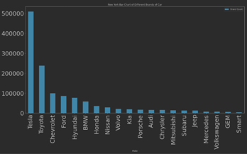
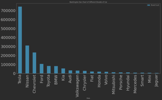

## Title：Analysis of the development of new energy vehicles in three states in the United States
Team members:  
Yichuan Hu(yh42):  Github: MarcccHuuu  
Bingcheng Zhong(bz15): Github: bbbbcccczzzz
 
### Github repo:
https://github.com/MarcccHuuu/2022Spring_Finals_EV

  The report will begin with the research background. And, we will show some information about the data we used. 
Then is our main part, our three hypotheses and its conclusions. At last, we will explain some main functions we created.
  
Research background:
  Nowadays, electric vehicles gradually become more popular. Especially in the United States, electric vehicles are 
gaining market share, but the development of electric vehicles varies by state. Therefore, this study is based on data 
on electric vehicles in Washington, Texas, and New York. By reviewing the relevant information, we will give three assumptions.

Data introduction:
  We found 5 csv files that are useful for our research.
  The first three files are the electric vehicle data from Washington, Texas, and New York state. They recorded the registrations of the electric vehicles in each area. From data of Newyork state, we can see there are around 290 thousand lines of data and 10 columns.

  And other two files are US Electric Vehicle Charging Station Data and US Population by Zip Code. US Electric Vehicle Charging Station Data has the information of charging piles, the registration time and other related information. What is more, US Population by Zip Code obtains the information about the population in each zip code, like population number, population density and other related information.

## Hypotheses
### Hypothesis 1: 
### What is the difference in sales between different brands of new energy vehicles？
  we have three hypotheses. The first one is : What is the difference in sales between different brands of new energy vehicles？
  We studied the distribution of vehicle brands in New York, Texas and Washington in 2020-2022, so the variables we need are the registration time of the car, the brand of the car, and use some visualizations for data presentation.

  Take New York state for example, we sort the vehicles according to the sales of different brands and take out the top 20 models for visualization. First, from the statistics and bar charts, Tesla outsells other brands of models by an absolute advantage. From the pie chart, Tesla sells more than one-third of all electric vehicles sold in New York State, followed by Toyota at 18.5 percent. After 2020, Tesla and Toyota’s electric vehicles will occupy more than half of the entire New York State market.

  These two bar charts are from Washington and Texas state.

  Overall, Washington State has the most sales of electric cars.In terms of sales of different brands, although Tesla occupies the largest market in each state, the state with the largest sales volume is Washington State, however. The state with the largest relative market share is Texas, which shows that although the sales of electric vehicles in Washington state are good, Tesla is the most popular in Texas.
  Secondly, although Tesla is the most sold in every state, the advantage in Washington state is not as obvious as the other two states, which also shows that people in Washington state will have more different preferences when choosing electric vehicles.
Of course, there are many reasons for these differences, and these reasons require further analysis.

### Hypothesis 2: 
### Development trends for different electric vehicles are inconsistent. Tesla always possesses the most progressive models in the EV market.

  To analyze the topic, we further the research in three aspects as follows.
  Firstly, we count the total registration number in each month, quarter and year to draw a plot.

  According to the plot, EV developed very slowly before 2018. However, early in 2019, there occurred a huge boost in the EV market. The curve goes up to about four or five times each month, and immediately the registration number goes beyond 10 thousand and 30 thousand separately.
  From that time, BEV became the majority part of Electric Vehicle, and the Rising curve is steeper than the PHEV, it accounts for about 70% of the market.
  After that, the curve tends to be steady and the volatility can be ignored. In this way, we can say that both PHEV and BEV have different trends in different years.

  The second part is the quarterly sales curve.
  We have customized functions that can display the result of all models in all years, and can also display specific models and years.

  From the plot, we can see that most popular registered car is Tesla Model 3 in NY, Toyota Prius Prime is the second, and the third one is Tesla Model Y. Among all of them, the most craggy curve is Tesla Model 3.
  The reason I think it’s because it's the most popular EV brand among young people, and Tesla’s director Elon Musk did a lot of advertisements on social media and the Internet. so the decisions made by the customers are always due to their personal preferences and brand mania.
  In Washington state, Tesla Model 3 and Model S still possess the top place in the market. However, some other models like Nissan Leaf and Chevrolet Volt also occupied a large proportion. The curve is much more stable, probably due to the smaller population in the state and citizens there are more rational.

  The third part is Statical comparison. In the analysis of the market, month-on-month and year-on-year sequential comparisons can always provide effective feedback on the brand's potential and development trend.

  We use the “pct_change” function and set the parameter periods to 1, to compare the increase from this month to last month. We rank all the valid car models by descending order. Regarding Washington State, Tesla Model X and Model 3 are the top two models with the highest increase ratio in March of 2020 while Tesla Model Y and Model 3 are the top two. As time goes by, the dominance of Model 3 has changed because of new models’ arrival. 
  And In New York State, Nissan Leaf and Toyota RAV4 Prime start to keep up with Tesla. They have a great potential to gain more customers and advocators, probably because of their good word of mouth as time goes by.
  In conclusion, we can confirm that Development trends for different electric vehicles are inconsistent. And different types of EV, different states also have different results. Tesla now is the most progressive make in the EV market of these months, however, some new brands and makes are starting to make their mark in our sights. In other words, Tesla is facing some Crises and Challenges now.

### Hypothesis 3: 
### We expect there is a strong positive correlation between the number of electric and plug-in hybrid vehicles sold compared to the number of public charging stations in the same region.

  We expect there is a strong positive correlation between the number of electric and plug-in hybrid vehicles sold compared to the number of public charging stations in the same region.
  In Hypothesis 3, we continued to explore what factors are related to the number of electric vehicles. We first think of the number of charging piles, because the density of charging piles determines the difficulty of charging electric vehicles in this area. Therefore, we think that the number of charging piles will affect the development of electric vehicles. Therefore, we use linear regression to analyze the linear relationship between these two variables.

  First, we made a descriptive statistics chart and a boxplot of the number of cars, from which we can find that there is a lot of abnormal data in the three states, especially Washington state, which also shows that the data is far from the average and the data is very discrete. Therefore, the state with the largest standard deviation is also Washington state.

  The second is the descriptive statistics and boxplot of the number of charging piles. It can also be seen that the degree of dispersion of the data is relatively large, and the standard deviation of the data in Washington State is also the largest.

  Then, we perform linear regression on the variable: the number of charging piles per zip and the variable: the number of electric vehicles per zip to verify Hypothesis 3, through the straight line fitted by the linear regression, we found that the correlation coefficient is 0.34, which is a weak correlation, so we reject the hypothesis 3.

  What’s more, considering the fact that Battery Cars always need to charge in the range of only a few hundred kilometers, the decision of PHEV or BEV by the consumer may be influenced by the Charging Station around them. So we compare the total number of EV stations and PHEV rate of all EV vehicles in those regions by zip code. As the scatter plot and heatmap show, the correlation between them is really low. EV station is not an independent variable for PHEV rate.

  We also take EV station as the dependent variable, Using Multiple Linear Regression in python, The R-squared is 0.074 and each P-value is below 0.1. The linear regression model also cannot best explain the number of EV stations in each region.

  In this way, we may assume that there is no or very small relationship between EV owner’s decision and Charging Station. EV consumers purchase specific cars for other reasons. In fact, Even the Battery Electric Vehicle, energy supports them to drive for hundreds of kilometers. So in the face of technology, the reality factor has been greatly mitigated.

